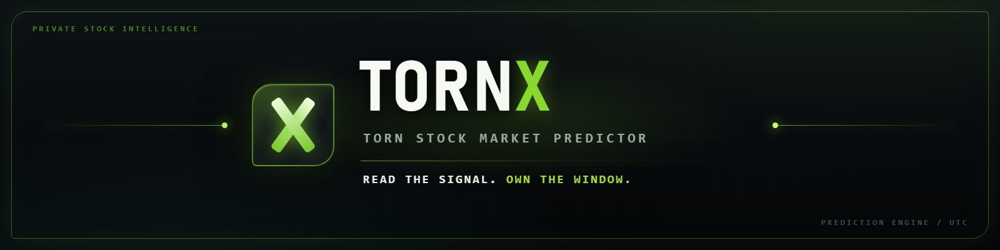
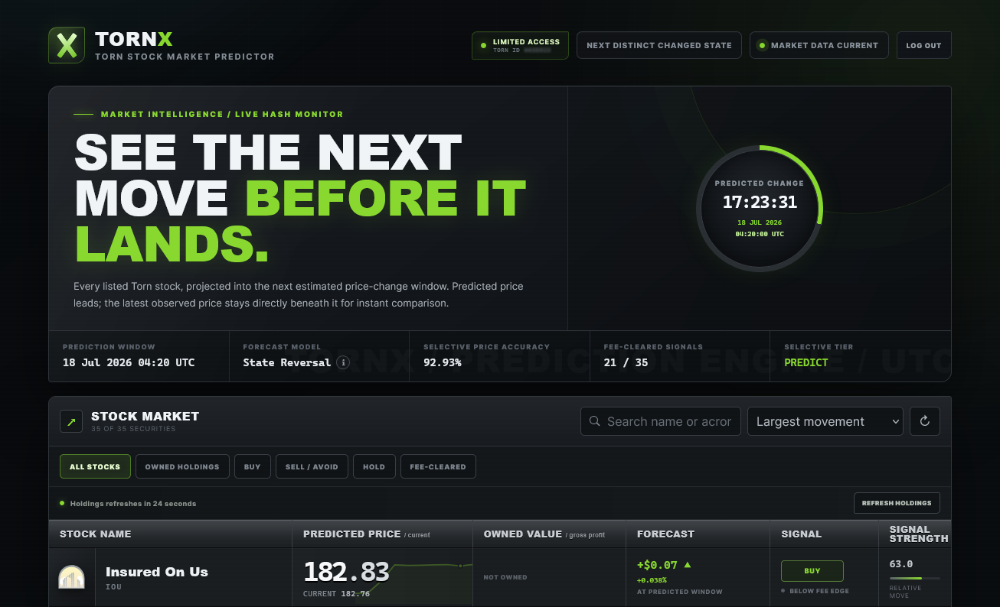

<p align="center">
  
</p>

<p align="center">
  <strong>A complete Torn stock-market cache, research, prediction, access-control, and dashboard stack.</strong>
</p>

<p align="center">
  
  
  
  
  
  
</p>

<p align="center">
  
  
  
  
</p>

> [!IMPORTANT]
> TornX is an independent community project. It is not affiliated with, endorsed by, or operated by Torn or Torn City. Forecasts are estimates, not guaranteed outcomes or financial advice.

## What TornX is

TornX records Torn's stock market on its authoritative 15-minute timestamp grid, separates the large historical base from new live observations, evaluates changed-state patterns, produces a forecast for every stock, and presents the result in an authenticated web dashboard.

The repository contains the complete project source and runtime assets, including:

- the historical and live stock cachers;
- the reverse-engineering and forward-validation lab;
- the production prediction class and JSON output;
- the authenticated HTTP server, portfolio integration, trials, whitelist, and admin panel;
- the animated TornX dashboard, social assets, forum material, build scripts, and compiled release files;
- supporting experiments and utilities shipped with the project.

<p align="center">
  
</p>

## How the pipeline fits together

<p align="center">
  
</p>

```text
stocks_cache.json       immutable historical base
        +
stocks_cache.jsonl      append-only post-freeze snapshots
        +
stocks_forward_test.json frozen model/cutoff state
        |
        v
stocks_algorithm_predictor
        |
        v
stocks_prediction.json  ->  stocks_server  ->  authenticated dashboard
```

The order of records in `stocks_cache.json` does not matter to the model as long as timestamps are valid and unique. `stocks_cache.jsonl` is maintained oldest-to-newest because it is the append-only live stream. The browser never reads either private data file directly; it uses authenticated server endpoints.

## Repository contents

| Path | Purpose |
|---|---|
| `stocks_cacher.py` | Fetches and caches 15-minute Torn stock snapshots; supports historical, live, sorting, and loop modes. |
| `stocks_algorithm_lab.py` | Research, validation, changed-state analysis, frozen-state creation, and forward testing. |
| `stocks_algorithm_predictor.py` | Production `StocksAlgorithmPredictor` class and `stocks_prediction.json` writer. |
| `stocks_server.py` | Threaded TornX web/auth/API server, live market watcher, access control, portfolio cache, and admin API. |
| `stocks_predictor.py` | Older standalone/experimental prediction engine retained for comparison. |
| `stocks_cache.json` | Large historical base cache. |
| `stocks_cache.jsonl` | Small append-only cache for observations after the frozen cutoff. |
| `stocks_forward_test.json` | Frozen experiment, model, and cutoff state. |
| `stocks_prediction.json` | Latest generated prediction payload. |
| `dist/` | Runtime directory: executables, dashboard, access files, automation, and images. |
| `web/` | Static public source-release landing page. |
| `reverse-proxy/` | Apache `.htaccess` reverse-proxy example. |
| `.build_*.bat` | Windows/PyInstaller build entry points. |
| `last_date_finder.py` | Cache inspection/helper utility. |

## Requirements

- Windows 10/11 for the supplied `.bat` automation and automatic firewall rule;
- Python 3.10 or newer when running or rebuilding from source;
- `numpy`, `chalkx`, and `pyinstaller`;
- `curl.exe` on `PATH` for `stocks_cacher.py`;
- a Torn **Limited Access** API key for collecting market snapshots;
- a modern browser;
- Git LFS before cloning or publishing the complete data-heavy repository;
- enough free disk space for the base cache, its release copy, graph, build output, and temporary save/backup files. Allow at least 3 GB.

Install the Python dependencies:

```powershell
py -m pip install --upgrade numpy chalkx pyinstaller
```

## Security before first use

> [!CAUTION]
> Do not publish a real API key, `server_logs.jsonl`, populated access files, active prediction/session material, or other user data. Rotate any key that has ever been committed. Review the repository with a secret scanner before pushing it anywhere public.

The collector reads its service key from the `TORN_API_KEY` environment variable. Set that variable instead of committing a credential:

```powershell
$env:TORN_API_KEY="YOUR_LIMITED_ACCESS_KEY"
```

That command sets the key only for the current PowerShell process. To save it for your Windows user account:

```powershell
[Environment]::SetEnvironmentVariable("TORN_API_KEY","YOUR_LIMITED_ACCESS_KEY","User")
```

Open a new terminal after setting a persistent variable. The dashboard's users provide their own Limited Access keys at login; those keys are checked by `stocks_server.py` and are not the collector key.

There is no build-time API key inside `stocks_algorithm_lab.py` or `stocks_algorithm_predictor.py`: those programs read local cache/model files and do not call Torn's API. Before rebuilding them, verify their `DEFAULT_CACHE`, `DEFAULT_LIVE_CACHE`, `DEFAULT_FORWARD`, and `DEFAULT_PREDICTION` paths. The Torn API key belongs in `TORN_API_KEY` for the cacher.

## Quick start: prebuilt release

All commands in this section run from `dist/`. Keep the executables and their data/UI files together.

1. Set `TORN_API_KEY` as shown above.
2. Confirm these files are beside the executables:

   ```text
   stocks_cache.json
   stocks_cache.jsonl
   stocks_forward_test.json
   stocks_prediction.json
   index.html
   admin_panel.html
   server_admins.json
   server_whitelist.json
   server_trials.json
   server_blacklist.json
   tornx-social-preview.png
   ```

3. Open the first terminal and start the web service:

   ```powershell
   cd .\dist
   .\stocks_server.exe
   ```

4. Open a second terminal and start the continuous cache/prediction cycle:

   ```powershell
   cd .\dist
   .\stocks_live_predictor.bat
   ```

5. Open `http://localhost:8676/`, or the configured public origin through your reverse proxy.

Keep **both** `stocks_server.exe` and `stocks_live_predictor.bat` running. The server owns the dashboard and authenticated endpoints. The batch file waits for the relevant UTC window, runs `stocks_cacher.exe --live`, regenerates `stocks_prediction.json`, then repeats.

## Quick start: Python source

From the repository root:

```powershell
$env:TORN_API_KEY="YOUR_LIMITED_ACCESS_KEY"
py .\stocks_cacher.py --live
py .\stocks_algorithm_predictor.py
Copy-Item -LiteralPath .\stocks_cache.json -Destination .\dist\stocks_cache.json -Force
Copy-Item -LiteralPath .\stocks_cache.jsonl -Destination .\dist\stocks_cache.jsonl -Force
Copy-Item -LiteralPath .\stocks_forward_test.json -Destination .\dist\stocks_forward_test.json -Force
Copy-Item -LiteralPath .\stocks_prediction.json -Destination .\dist\stocks_prediction.json -Force
py .\stocks_server.py
```

When run from source, `stocks_server.py` intentionally serves the files in `dist/`, which is why the example synchronizes the four runtime data files before starting it. The predictor writes `stocks_prediction.json` beside its source by default, while the built predictor writes beside its executable. For continuous operation, the prebuilt two-terminal flow is the supported layout because every process reads and writes the same `dist/` directory.

To use the predictor as a class:

```python
from stocks_algorithm_predictor import StocksAlgorithmPredictor

predictor=StocksAlgorithmPredictor(
    cache_file="stocks_cache.json",
    live_cache_file="stocks_cache.jsonl",
    forward_file="stocks_forward_test.json",
    prediction_file="stocks_prediction.json"
)
result=predictor.predict(save=True)

for stock in result.predictions:
    print(stock.stock,stock.action,stock.predicted_price,stock.target_timestamp)
```

`predict(save=True)` writes the JSON atomically and adds a SHA-256 payload hash. `predict(save=False)` returns the dataclass result without writing a file.

## Initial model setup and frozen cutoff

The checked-in `stocks_forward_test.json` is the frozen model/cutoff used by live collection and production prediction. If you intentionally want to create a new experiment, first back up the current state, make sure the base cache ends at the intended cutoff, and run:

```powershell
py .\stocks_algorithm_lab.py `
  --cache .\stocks_cache.json `
  --live-cache .\stocks_cache.jsonl `
  --forward-file .\stocks_forward_test.json `
  --changed-only `
  --target-accuracy 90 `
  --sell-fee 0.1 `
  --freeze-forward
```

Do not repeatedly move the cutoff merely to make a score look better. A valid forward test keeps its training cutoff frozen and scores only later observations:

```powershell
py .\stocks_algorithm_lab.py --forward-test
```

`stocks_cacher.py --live` reads that frozen cutoff and fills every missing 15-minute timestamp from `cutoff + 15 minutes` through the latest due window. It does not require `--days`.

## Rebuilding the executables

Edit configuration first, then run the build scripts from a normal Command Prompt or PowerShell window:

```powershell
.\.build_stocks_cacher.bat
.\.build_stocks_algorithm_lab.bat
.\.build_stocks_algorithm_predictor.bat
.\.build_stocks_server.bat
```

The optional legacy build is:

```powershell
.\.build_stocks_predictor.bat
```

Build artifacts go to `dist/`, and temporary PyInstaller files go to `build/`. The lab/predictor build scripts copy the three required cache/model files into `dist/` only when those destination files do not already exist. Rebuilding an executable therefore does not overwrite a newer live cache.

After changing `PORT`, rebuild `stocks_server.exe`. Its Windows Firewall rule name and inbound rule are derived from that port. If the automation interval changes, update both `INTERVAL` in Python and the hardcoded `900`-second calculation in `dist/stocks_live_predictor.bat`.

## Configuration reference

### Collector: `stocks_cacher.py`

| Value | Default | Meaning |
|---|---:|---|
| `INTERVAL` | `900` seconds | Authoritative snapshot grid. Keep at 15 minutes unless the upstream API changes. |
| `REQUEST_DELAY` | `0.61` seconds | Minimum spacing used to stay below 100 requests/minute. |
| `RATE_LIMIT_WAIT` | `60` seconds | Retry countdown after rate limiting/empty responses. |
| `LOOP_SAFETY_DELAY` | `3` seconds | Extra wait after a window boundary. |
| `API_URL` | Torn v2 stocks endpoint | Upstream market-data endpoint. |
| `TORN_API_KEY` | environment variable | Limited Access key used for market-data collection. |
| `CACHE_FILE` | `stocks_cache.json` | Historical cache path beside the script/executable. |
| `LIVE_CACHE_FILE` | `stocks_cache.jsonl` | Append-only post-cutoff cache path. |
| `FORWARD_FILE` | `stocks_forward_test.json` | Supplies the maximum historical cutoff for `--live`. |

Collector commands:

| Command | Result |
|---|---|
| `stocks_cacher.exe` | Cache the current day, newest-to-oldest. |
| `stocks_cacher.exe TIMESTAMP` | Use the supplied Unix timestamp as the range anchor. |
| `stocks_cacher.exe --days 30` | Cache 30 calendar days. |
| `stocks_cacher.exe --oldest-first` | Process oldest-to-newest. |
| `stocks_cacher.exe --sort` | Sort the full JSON cache; combines with `--oldest-first`. |
| `stocks_cacher.exe --live` | Fill missing post-cutoff windows into JSONL, oldest-to-newest. |
| `stocks_cacher.exe --live --loop` | Run live collection at every UTC 15-minute boundary plus the safety delay. |

The supplied `stocks_live_predictor.bat` already implements its own wait/predict loop, so it calls plain `--live`; do not add `--loop` to that batch file.

### Algorithm lab: `stocks_algorithm_lab.py`

| Value/option | Default | Meaning |
|---|---:|---|
| `--cache` | `stocks_cache.json` | Historical base. |
| `--live-cache` | `stocks_cache.jsonl` | Post-cutoff observations. |
| `--forward-file` | `stocks_forward_test.json` | Frozen experiment state. |
| `--validation` | `0.20` | Held-out validation fraction; accepted range is 0.05–0.50. |
| `--model` | `auto` | `auto`, `persistence`, `previous`, `ar2`, or `extrapolation`. |
| `--top` | `35` | Number of displayed stocks. |
| `--target-accuracy` | `90` percent | Requested high-confidence action threshold. |
| `--sell-fee` | `0.1` percent | Fee applied on sale, not purchase. |
| `--changed-only` | off | Predict/score the next distinct changed state. |
| `--event-samples` | `10` | Held-out changed-window examples shown. |
| `--freeze-forward` | off | Create a new frozen state at the current base cutoff. |
| `--forward-test` | off | Score only observations after the frozen cutoff. |
| `--json` | off | Emit machine-readable output. |

Advanced research constants near the top of the file include `THRESHOLDS`, `EVENT_CELL_THRESHOLDS`, `EVENT_CHAIN_THRESHOLDS`, `EVENT_COUNT_THRESHOLDS`, `EVENT_STRONG_Z`, `EVENT_SAFETY_MARGIN`, `EVENT_MIN_ACTIONS`, `CONDITIONAL_CELL_Z`, `PRICE_RUN_CANDIDATES`, `PRICE_HORIZON_CANDIDATES`, `PRICE_MIN_ACTIONS`, `FORWARD_MIN_DAYS`, `FORWARD_MIN_CLUSTERS`, `FORWARD_MIN_CALENDAR_DAYS`, and `FORWARD_CLUSTER_GAP`. Changing them creates a different experiment and should be followed by a fresh, honest frozen forward test.

### Production predictor: `stocks_algorithm_predictor.py`

The production executable has no CLI switches. Edit these defaults before rebuilding, or pass their equivalents to the class constructor:

| Value | Default |
|---|---|
| `DEFAULT_CACHE` | `stocks_cache.json` beside the program |
| `DEFAULT_LIVE_CACHE` | `stocks_cache.jsonl` beside the program |
| `DEFAULT_FORWARD` | `stocks_forward_test.json` beside the program |
| `DEFAULT_PREDICTION` | `stocks_prediction.json` beside the program |

Running `stocks_algorithm_predictor.exe` always saves and prints the complete all-stock prediction payload.

### Server: `stocks_server.py`

| Value/environment variable | Default | Meaning |
|---|---:|---|
| `HOST` | `0.0.0.0` | Bind every local IPv4 interface. Usually leave this unchanged. |
| `PORT` | `8676` | Local listen and firewall port. |
| `TORNX_PUBLIC_ORIGIN` | `https://tornx.187.be` | Browser-facing HTTPS origin used behind the reverse proxy. |
| `TORNX_KEY_INFO_URL` | Torn v2 key-info endpoint | Login key validation endpoint. |
| `TORNX_USER_STOCKS_URL` | Torn v2 user-stocks endpoint | Holdings endpoint. |
| `TORNX_SECURE_COOKIE` | false unless truthy | Set `1` behind HTTPS so the session cookie is Secure. |
| `TRIAL_DURATION_SECONDS` | 7 days | Duration assigned to a newly added trial. |
| `HISTORY_SCAN_SNAPSHOTS` | `672` | Live snapshots scanned for chart history. |
| `HISTORY_POINTS` | `24` | Points returned per stock sparkline. |
| `CACHE_QUIET_SECONDS` | `10` | Debounce before rereading a changing live cache. |
| `CACHE_WATCH_INTERVAL` | `0.5` seconds | Cache file stat interval. |
| `PREDICTION_QUIET_SECONDS` | `1` second | Prediction-file debounce. |
| `SESSION_TTL` | 12 hours | Normal authenticated session lifetime. |
| `REMEMBERED_SESSION_TTL` | 30 days | “Remember me” session lifetime. |
| `AUTH_WINDOW_SECONDS` | `60` | Login-attempt rate-limit window. |
| `AUTH_MAX_ATTEMPTS` | `10` | Attempts allowed in that window. |
| `PORTFOLIO_CACHE_SECONDS` | `60` | Holdings cache/normal refresh interval. |
| `INVALIDATED_SESSION_TTL` | 24 hours | Retention for displaced session identifiers. |
| `MAX_BODY_BYTES` | `4096` | Maximum accepted API request body. |

Example production environment:

```powershell
$env:TORNX_PUBLIC_ORIGIN="https://your-domain.example"
$env:TORNX_SECURE_COOKIE="1"
.\stocks_server.exe
```

To change the LAN/public IP, do **not** replace `HOST` with the router's public address. Keep `HOST="0.0.0.0"`, give the host machine a stable LAN address, forward the chosen TCP `PORT` to that address, allow it through the host firewall, and point the reverse proxy at `LAN_OR_PUBLIC_IP:PORT`.

Update the canonical, Open Graph, and Twitter URLs in `dist/index.html` when changing domains. Front-end timing values are grouped near `PORTFOLIO_REFRESH_MS`, `PORTFOLIO_RETRY_MS`, and `MARKET_STATUS_POLL_MS`; stock names/IDs are grouped near `stockNames` and the stock metadata table.

## Access-control files

These runtime files live beside `stocks_server.exe` and are loaded dynamically:

| File | Format | Purpose |
|---|---|---|
| `server_admins.json` | `[1234567,2345678]` | User IDs allowed to render/use the admin panel. |
| `server_whitelist.json` | `[1234567,2345678]` | Permanent-access user IDs. |
| `server_trials.json` | JSON object managed by the server | Seven-day trial end time and expired state per user. |
| `server_blacklist.json` | JSON object | Internal abuse/security blocks. It is no longer the admin panel's access list. |
| `server_logs.jsonl` | append-only JSONL | Authentication and admin audit events when present. Treat as a secret. |

A user in either the permanent whitelist or an active trial has access. Admins can add/remove permanent access and trials. Expired trial entries remain expired until an admin removes and adds the user again. Lists are reread dynamically; a server restart is not required for normal admin changes.

Only one active login session is kept per Torn user ID. A newer login invalidates the older session. Server restart clears in-memory sessions and portfolio cache.

## Reverse proxy and public hosting

The previously used Apache reverse-proxy configuration is included at `reverse-proxy/.htaccess`. Copy that file to the document root of the public domain—the same directory in which Apache receives requests for TornX.

It requires Apache's `mod_rewrite`, `mod_proxy`, `mod_proxy_http`, and `mod_headers` modules. Replace the two marked values before using it:

```apache
RewriteEngine On
RewriteCond %{HTTPS} !=on
RewriteRule ^ https://%{HTTP_HOST}%{REQUEST_URI} [R=301,L]

RequestHeader set X-Forwarded-Proto "https"
RequestHeader set X-Forwarded-Host "YOUR_PUBLIC_DOMAIN"

RewriteRule ^ http://YOUR_TORNX_SERVER_IP:YOUR_TORNX_PORT%{REQUEST_URI} [P,L,NE]
```

Enter the values as follows:

| Placeholder | What to enter | Example |
|---|---|---|
| `YOUR_PUBLIC_DOMAIN` | The HTTPS domain visitors open, without `https://` and without a trailing slash. | `tornx.example.com` |
| `YOUR_TORNX_SERVER_IP` | The IP address the Apache host can use to reach the computer running `stocks_server.exe`. Use its public IPv4 address when Apache is remote, or its LAN address when both systems share a network. | `203.0.113.25` |
| `YOUR_TORNX_PORT` | The same port configured as `PORT` in `stocks_server.py`, forwarded through the router and allowed by Windows Firewall. | `8676` |

For example, if users visit `https://tornx.example.com`, the TornX computer is reachable at `203.0.113.25`, and the server listens on `8676`, the final proxy lines are:

```apache
RequestHeader set X-Forwarded-Proto "https"
RequestHeader set X-Forwarded-Host "tornx.example.com"
RewriteRule ^ http://203.0.113.25:8676%{REQUEST_URI} [P,L,NE]
```

On the TornX computer, configure the matching public origin before starting the server:

```powershell
$env:TORNX_PUBLIC_ORIGIN="https://tornx.example.com"
$env:TORNX_SECURE_COOKIE="1"
.\stocks_server.exe
```

Then complete the network side:

1. Point the domain's DNS record at the Apache host and install a valid HTTPS certificate there.
2. Keep `HOST="0.0.0.0"` in `stocks_server.py` so TornX accepts non-local connections.
3. Forward `YOUR_TORNX_PORT` from the TornX router to the computer running `stocks_server.exe` if Apache is outside that network.
4. Allow that same TCP port through Windows Firewall. The compiled server offers to install its matching firewall rule on first launch.
5. Update the canonical, Open Graph, and Twitter URLs in `dist/index.html` to the public domain.
6. Start `stocks_server.exe`, then test the public `/` page and `/api/auth/session` endpoint.

TLS terminates at the public Apache proxy; the proxy-to-TornX connection may remain HTTP. Do not expose private JSON/JSONL files through a second static web server—TornX deliberately blocks direct requests for caches, predictions, logs, and access-control files.

If Apache returns its own `404 Not Found`, the request did not reach TornX. Confirm the `.htaccess` file is in the active document root and that `AllowOverride FileInfo` is enabled. If Apache returns `500`, check that the four required modules and proxying from `.htaccess` are permitted by the host. Some shared hosting providers prohibit reverse-proxy directives; in that case the equivalent rules must be added to the Apache virtual-host configuration by the provider.

## Large project files

The historical caches, generated graph, executables, archive, and browser extension are tracked with Git LFS. Install Git LFS and download the tracked files after cloning:

```powershell
git lfs install
git lfs pull
```

## Validation, operation, and backups

- Preserve the original historical base once an experiment is frozen.
- Let live observations accumulate only in `stocks_cache.jsonl`.
- Keep all timestamps on the 900-second grid and never duplicate a timestamp.
- Back up `stocks_cache.json`, `stocks_cache.jsonl`, and `stocks_forward_test.json` before changing the cutoff or model.
- Check `stocks_algorithm_lab.py --forward-test` rather than treating training/backtest accuracy as deployment proof.
- Keep system time synchronized; cache and automation timing use UTC Unix timestamps.
- The cacher creates a temporary backup during full-file saves and removes it after a successful replacement.

## Project effort

TornX contains roughly 12,800 lines of source/UI/automation plus the historical dataset, research iterations, prediction validation, cache recovery behavior, authentication, portfolio integration, access management, responsive dashboard, promotional artwork, Windows packaging, reverse-proxy work, and operational testing.

Approximately **450 hours of work** have gone into bringing TornX from the original idea to this release. That includes the prediction research, historical-data cleanup, backend and authentication work, interface design, testing, deployment tooling, and repeated refinement against live behavior. It is an estimate rather than a timesheet total.

## License

TornX is licensed under the **GNU Affero General Public License v3.0 (AGPL-3.0)**. See the repository's [`LICENSE`](../LICENSE) file for the complete license terms.

## Next major update

Anyone who wants to build a more advanced TornX than this release can use [`.todo-stocks-server.txt`](../.todo-stocks-server.txt) as the roadmap for the next major update. It contains the planned server, prediction, interface, and operational improvements that were not completed in the current version.

## Credits

TornX was built from years of market history, extensive prediction experiments, continuous live testing, and a great deal of iteration on the product and interface.

<p align="center">
  <strong>TornX</strong><br>
  <sub>PRIVATE STOCK INTELLIGENCE · 15-MINUTE MARKET SIGNALS</sub>
</p>
